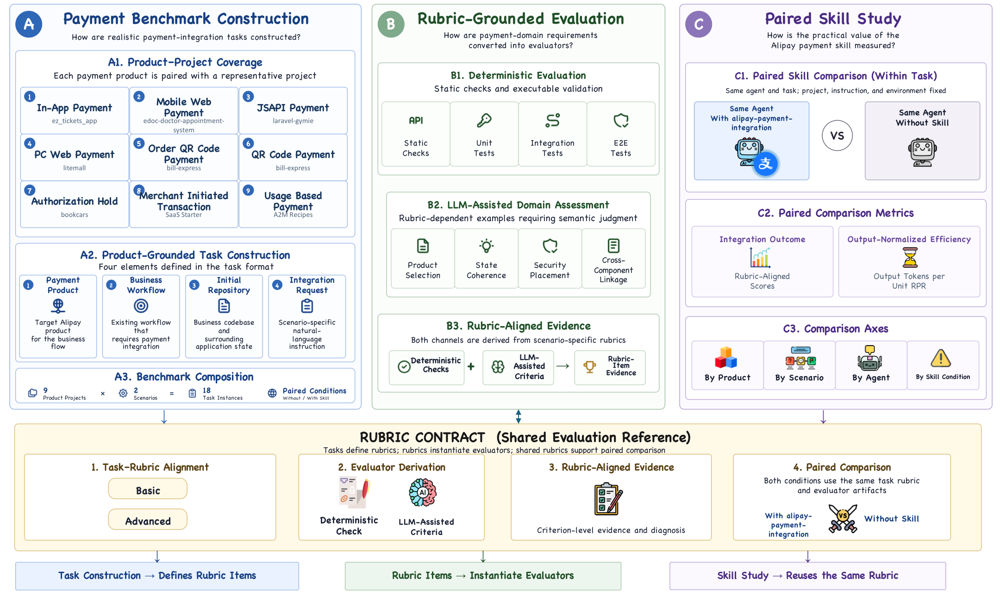
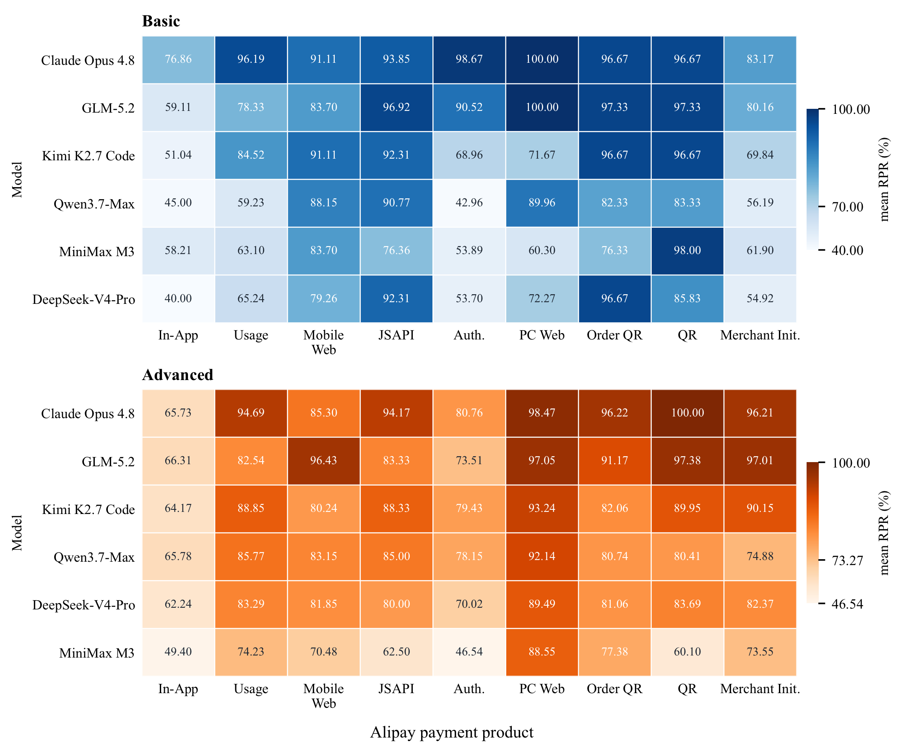

<div align="center">
  <h1>Alipay-PIBench: A Realistic Payment Integration Benchmark for Coding Agents</h1>
</div>

<div align="center">
  <a href="LICENSE"></a>
  <a href="https://arxiv.org/abs/2607.14573"></a>
</div>

<p align="center">
  <a href="README.zh-CN.md">中文说明</a>
</p>

---

## 🎯 Introduction

Alipay-PIBench is a repository-level benchmark proposed by Alipay for evaluating AI coding agents on realistic payment integration tasks. Built around Alipay Open Platform products and business-oriented repositories, it comprises nine product-specific projects and 18 task instances across Basic (Functional Payment Completion) and Advanced (Risk-Aware Payment Hardening) scenarios. The benchmark evaluates functional correctness, reliability, security, and business-state consistency.

- **Payment Benchmark Construction.** Each payment product is paired with a representative project, and each task combines the target product, business workflow, initial repository, and scenario-specific integration request.
- **Rubric-Grounded Evaluation.** Scenario-specific rubrics define deterministic checks and LLM-assisted criteria, producing rubric-aligned evidence for structural, executable, and payment-domain requirements.
- **Paired Skill Study.** Each agent is evaluated on the same task, project, instruction, and environment with and without [`alipay-payment-integration`](https://github.com/alipay/ai/tree/main/skills/alipay-payment-integration), enabling comparisons by product, scenario, agent, and skill condition.

[](assets/overview.pdf)

## 🏆 Main Results

### Model Capability

[](assets/main-results.pdf)

Model capability explains much of the observed performance spread and varies across products and scenarios. Under the with-skill condition, overall mean Rubric Pass Rate (RPR) ranges from **68.58% to 91.37%**. Basic and Advanced tasks provide complementary views of an agent's ability to construct a payment flow and preserve safety-related payment behavior.

For results and detailed analyses of the remaining research questions, please refer to the [paper](https://arxiv.org/abs/2607.14573).

## 🚀 Quick Start

### Requirements

Run the suite on a Linux host or cloud server with:

- Bash
- Python 3
- Git
- Docker Engine, with permission for the current user to access the Docker daemon
- Network access to the selected model provider, Docker image registry, and task-specific package repositories
- Enough disk space to build task images and store run artifacts

The default configuration enables Docker because each task instance defines its own application, database, and development environment.

### Run the Benchmark

This release is self-contained. It includes the benchmark suite, deterministic and LLM-assisted evaluations, three agent adapters (Claude Code, OpenClaw, and Hermes), the PaySkills runtime source, Docker orchestration, concurrent execution, and a top-level `run.sh`. You do not need to install the PaySkills platform.

```bash
# Show command help.
./run.sh --help

# Create config/.env without overwriting an existing file.
./run.sh --init

# Configure the run and local secrets.
vim config/config.yaml
vim config/.env

# Validate package layout, configuration, credentials, tools, and Docker.
./run.sh --doctor

# List selected task instances without invoking an agent or judge.
./run.sh --dry-run

# Start the evaluation.
./run.sh
```

`config/.env` is loaded automatically and ignored by Git. Do not put real API keys or Alipay sandbox private keys directly in `config/config.yaml`.

To keep multiple local configurations, pass one explicitly or set `PAYSKILLS_CONFIG`:

```bash
./run.sh --config config/config.local.yaml --doctor
./run.sh --config config/config.local.yaml
PAYSKILLS_CONFIG=/absolute/path/to/config.yaml ./run.sh --doctor
```

## ⚙️ Configuration

The active configuration is `config/config.yaml`. `config/config.example.yaml` is the reference template.

### Run

```yaml
run:
  parallelism: 4
  output_dir: runs
  timeout_sec: 3600
  task_instances: []
```

- `parallelism`: maximum number of task instances executed concurrently
- `output_dir`: safe relative output directory; do not use package paths such as `benchmark_suite/`, `config/`, or `src/`
- `timeout_sec`: timeout applied separately to `task/run.sh` and `evaluation/evaluate.sh`
- `task_instances`: optional list of task instance IDs; an empty list selects all 18

Keep configuration types literal: positive integers for `parallelism` and `timeout_sec`, a YAML list for `task_instances`, mappings for `env` and `runtime_inputs`, and booleans for `docker.enabled` and `docker.build`.

### Agent

```yaml
agent:
  type: claude-code
  mode: no-skill
  model: "your-agent-model"
  base_url: "https://your-provider.example/api/anthropic"
  api_key_env: AGENT_API_KEY
```

- `type`: `claude-code`, `openclaw`, or `hermes`
- `mode`: `no-skill` or `with-skill`
- `model`: model name understood by the selected adapter and provider
- `base_url`: provider endpoint; configure it together with `api_key_env`
- `api_key_env`: name of the environment variable containing the key, not the key itself

Set the referenced variable in `config/.env`:

```bash
AGENT_API_KEY="your-secret-key"
```

### LLM Judge

```yaml
judge:
  base_url: "https://your-provider.example/v1"
  api_key_env: JUDGE_API_KEY
  model: "your-judge-model"
```

Fill all three judge settings together. Store the referenced key in `config/.env`:

```bash
JUDGE_API_KEY="your-secret-key"
```

The agent and judge may reference the same environment variable when they use the same provider credential.

### Extra Environment Variables

Values under `env` are copied into every task instance process:

```yaml
env:
  CUSTOM_FLAG: value
```

Use `runtime_inputs`, not `env`, for structured files or secrets requested by specific task instances.

### Alipay Sandbox Runtime Input

Some task instances require Alipay sandbox information. Obtain it from the [Alipay Developer Sandbox](https://open.alipay.com/develop/sandbox/app), and keep it outside the benchmark suite and Git history.

For identity-sensitive tasks, `app_id` and `seller_id` are distinct: the app ID identifies the sandbox application, while the seller ID is the merchant PID receiving funds. Do not copy the app ID into the seller ID field.

To provide sandbox data from `config/.env`:

```yaml
runtime_inputs:
  alipay_sandbox:
    schema: alipay.sandbox.v1
    source: env
    app_id_env: ALIPAY_APP_ID
    seller_id_env: ALIPAY_SELLER_ID
    gateway_env: ALIPAY_GATEWAY
    merchant_private_key_pkcs8_env: ALIPAY_MERCHANT_PRIVATE_KEY_PKCS8
    merchant_private_key_pkcs1_env: ALIPAY_MERCHANT_PRIVATE_KEY_PKCS1
    alipay_public_key_env: ALIPAY_PUBLIC_KEY
    sandbox_buyer_account_env: ALIPAY_SANDBOX_BUYER_ACCOUNT
    sandbox_buyer_login_password_env: ALIPAY_SANDBOX_BUYER_LOGIN_PASSWORD
    sandbox_buyer_pay_password_env: ALIPAY_SANDBOX_BUYER_PAY_PASSWORD
    miniapp_app_id_env: ALIPAY_MINIAPP_APP_ID
    op_app_id_env: ALIPAY_OP_APP_ID
```

Then fill the variables required by the selected task instances in `config/.env`. This suite contains Java and non-Java projects, so provide both PKCS#8 and PKCS#1 merchant private-key forms for a complete run.

You can instead use a local JSON file:

```yaml
runtime_inputs:
  alipay_sandbox:
    schema: alipay.sandbox.v1
    source: file
    path: ../secrets/alipay-sandbox-keys.json
```

Relative paths are resolved from the directory containing the selected configuration file. With `config/config.yaml`, the example above resolves to `secrets/alipay-sandbox-keys.json` at the package root. Keep that local file out of Git.

The JSON structure is:

```json
{
  "app_id": "<your-sandbox-app-id>",
  "seller_id": "<your-sandbox-merchant-pid>",
  "gateway": "https://openapi-sandbox.dl.alipaydev.com/gateway.do",
  "sign_type": "RSA2",
  "merchant_private_key_pkcs8": "<merchant-private-key-pkcs8>",
  "merchant_private_key_pkcs1": "<merchant-private-key-pkcs1>",
  "alipay_public_key": "<alipay-public-key>",
  "sandbox_buyer": {
    "account": "<sandbox-buyer-account>",
    "login_password": "<sandbox-buyer-login-password>",
    "pay_password": "<sandbox-buyer-pay-password>"
  },
  "miniapp_app_id": "<optional-miniapp-app-id>",
  "op_app_id": "<optional-op-app-id>"
}
```

Fill the fields required by the selected task instances. In Docker mode, the runtime input is mounted read-only under `/run/payskills/inputs/` and exposed through the environment variable declared by the task instance, such as `ALIPAY_SANDBOX_KEYS_FILE`. When a task declares `workspace_path`, the runtime also copies the file into `/workspace` before the agent starts.

### Docker

```yaml
docker:
  enabled: true
  build: true
  image: ""
  network: ""
```

- `enabled`: run task instances in Docker; the release default is `true`
- `build`: build each selected task instance's `task/Dockerfile`
- `image`: existing local image used when `build` is `false`
- `network`: optional Docker network name

With Docker enabled, the runtime mounts `/task_instance`, `/workspace`, `/output`, and `/opt/payskills_runtime` inside the sandbox. Task images must include `bash`, `python3`, and `git`.

### Selecting Task Instances

Specify task instance IDs in `config/config.yaml`:

```yaml
run:
  task_instances:
    - EDoc-MobileWebPayment-basic
    - Litemall-PCWebPayment-advanced
```

Run `./run.sh --dry-run` to confirm the final selection and helper requirements.

## 📦 Run Outputs

Each run creates:

```text
runs/<timestamp>/
  summary.json
  <task-instance-label>/
    result.json
    execution.json
    logs/
      run_stdout.log
      diff_export.log
      evaluation_output.txt
    artifacts/
      agent_trace.json
      agent_events.jsonl
      agent_evidence.json
      patch.diff
      changed_files.txt
      code_files/
```

- `summary.json`: run index and aggregate task status
- `result.json`: score and per-rubric pass/score results written by the evaluation
- `execution.json`: runtime status for the run, diff, and evaluation phases
- `logs/`: raw phase logs
- `agent_trace.json`: standardized turn-level agent trace
- `agent_events.jsonl`: detailed agent event stream
- `agent_evidence.json`: compact evidence used by LLM-assisted evaluation
- `patch.diff`, `changed_files.txt`, `code_files/`: workspace changes produced by the agent

Run outputs may contain complete agent inputs, outputs, commands, and runtime sandbox material. Treat the entire run directory as sensitive data and do not publish it without review.

## 🧩 Contracts

### Task Instance Contract

Each task instance follows this layout:

```text
benchmark_suite/task_instances/<task-instance-id>/
  task_instance.toml
  task/
    Dockerfile
    instruction.md
    turns.json
    run.sh
    fixtures/
    skills/
  evaluation/
    evaluate.sh
    rubrics.json
    deterministic/
    llm_assisted/
```

`task/run.sh` invokes the selected agent and writes non-scoring artifacts. `evaluation/evaluate.sh` runs deterministic and LLM-assisted evaluations and writes `$OUTPUT_DIR/result.json`.

`result.json` is the scoring contract. It contains numeric `score` and `max_score`, a summary, and a `rubrics` list. Each rubric records its own pass state, score, maximum score, type, and diagnostic message.

When a task instance calls `payskills-agent drive-turns`, the agent helper writes `agent_trace.json`, `agent_evidence.json`, and `agent_events.jsonl` under `artifacts/`. Use `agent_evidence.json` for LLM-assisted evaluation, `agent_trace.json` for turn-level summaries, and `agent_events.jsonl` for detailed debugging.

Legacy task layouts such as `environment/Dockerfile`, a task-root `run.sh`, or a task-root `test.sh` are rejected.

### Package Contract

`manifest.json` is the machine-readable package contract. It records:

- top-level runner commands
- required task instance paths
- configuration and helper CLI contracts
- standard run artifact paths

`./run.sh --doctor` validates the manifest, package layout, selected tasks, configuration, required commands, credentials, runtime inputs, and Docker readiness before creating a run.

## 🛠️ Troubleshooting

### Docker daemon is not reachable

Start Docker and confirm that `docker info` succeeds as the current user.

### Agent or judge model/API key is missing

Follow the `ERROR` and `HINT` lines from `./run.sh --doctor`. Check `agent`, `judge`, and the variables referenced in `config/.env`.

### Alipay sandbox input is missing

Configure `runtime_inputs.alipay_sandbox` and fill the referenced environment variables or local JSON file required by the selected tasks.

### Validate without starting an evaluation

```bash
./run.sh --doctor
./run.sh --dry-run
```

## ©️ Copyright

- Author: Alipay Team, DATA X AI Team
